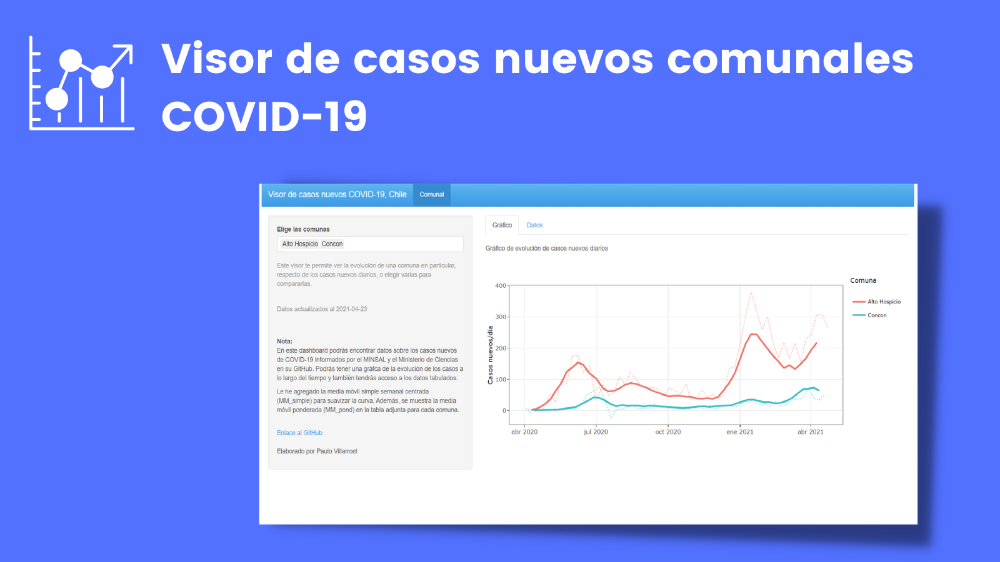

Este visor te permite ver la evolución de una comuna en particular, respecto de los casos nuevos diarios, o elegir varias para compararlas entre sí.

En este dashboard podrás encontrar datos sobre los casos nuevos de COVID-19 informados por el MINSAL y el Ministerio de Ciencias en su GitHub. Podrás tener una gráfca de la evolución de los casos a lo largo del tiempo y también tendrás acceso a los datos tabulados, lo cuales los puedes descargar.

Le he agregado la media móvil simple semanal centrada para suavizar la curva. Además, se muestra la media móvil ponderada en la tabla adjunta para cada comuna para analizar de mejor forma las tendencias.

Puedes acceder al visor en [este enlace.](https://paulovillarroel.shinyapps.io/App_shiny_covid/)
